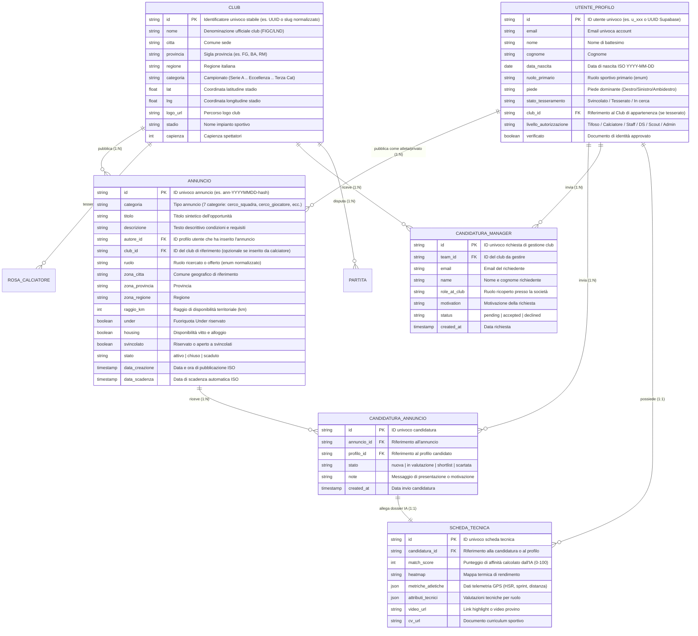

# Schema ER — Entità e Relazioni della Ricerca (Elisee Scout)

Documento di riferimento architetturale per le entità coinvolte nelle ricerche, nei filtri e nelle candidature di Elisee Scout.

---

## 1. Diagramma Entità-Relazione (ER)

---

## 2. Regole di Integrità Referenziale

1. **Club (`club_id`)**:
   - Ogni riferimento a `club_id` in annunci, candidature, rose e formazioni deve corrispondere a un record esistente in `CLUB`.
   - Se un annuncio è pubblicato da un atleta svincolato (`cerco_squadra`), il campo `club_id` è nullo (`NULL`), mentre `autore_id` è obbligatorio.

2. **Unicità delle Candidature (Anti-Duplicazione)**:
   - È vietata la doppia candidatura attiva per la stessa coppia `(annuncio_id, profilo_id)`. Vincolo: `UNIQUE(annuncio_id, profilo_id)`.
   - Per le richieste di gestione club: `UNIQUE(team_id, email, status='pending')`.

3. **Separazione tra Fonte di Verità e Cache di Lettura**:
   - **Fonte di Verità (Master)**: Record normalizzati con chiavi esterne.
   - **Cache di Lettura (KV / Elastic / In-Memory)**: Documento denormalizzato contenente i campi del Club (`nome`, `logo`, `citta`, `categoria`) pre-innestati all'interno dell'oggetto dell'annuncio per garantire ricerche a latenza ultra-bassa (<20ms).
